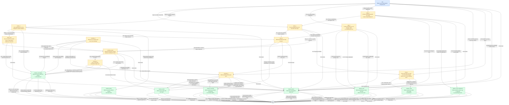

# Questions flow

The decision graph used by `Questions` in [questions.js](./questions.js). Answer paths lead to another question or to `END`. Anchor selection follows separately.

```mermaid
flowchart TD

    %% =========================
    %% ENTRY
    %% =========================

    root["root<br/>What is your mind trying to do right now?"]


    %% =========================
    %% PROBLEM SOLVING
    %% =========================

    solve_1["solve_1<br/>Do you already know one concrete next step?"]

    solve_2["solve_2<br/>What would that next step involve?"]


    %% =========================
    %% FUTURE / WORRY
    %% =========================

    future_1["future_1<br/>Can anything you do now change the actual situation?"]

    future_info["future_info<br/>Do you need one specific piece of information<br/>before you can act?"]


    %% =========================
    %% CERTAINTY / INFORMATION
    %% =========================

    certainty_1["certainty_1<br/>What are you trying to get from more thinking?"]

    certainty_value["certainty_value<br/>Would knowing this change what you actually do next?"]

    certainty_2["certainty_2<br/>Can you get that information right now?"]


    %% =========================
    %% PAST / RUMINATION
    %% =========================

    past_1["past_1<br/>Is there anything you can change, repair,<br/>or do differently now?"]


    %% =========================
    %% SELF-JUDGMENT
    %% =========================

    judge_1["judge_1<br/>Is there something specific you need<br/>to take responsibility for?"]


    %% =========================
    %% CHECKING / REASSURANCE
    %% =========================

    checking_1["checking_1<br/>What would this check give you?"]


    %% =========================
    %% META / STUCK LOOP
    %% =========================

    meta_1["meta_1<br/>Does it feel like you need to resolve this thought<br/>before you can do anything else?"]


    %% =========================
    %% RELEASE NODES
    %% =========================

    release_action["release_action<br/>When will you take that one step?"]

    release_uncertainty["release_uncertainty<br/>What can you do while the answer<br/>is still unknown?"]

    release_future["release_future<br/>What can you do without solving<br/>the future first?"]

    release_past["release_past<br/>What would help you leave the past<br/>where it is for now?"]

    release_self_compassion["release_self_compassion<br/>What would be a fairer way to respond<br/>to yourself right now?"]

    release_checking["release_checking<br/>What could you do instead of checking<br/>for certainty again?"]

    release_meta["release_meta<br/>What could you do while the thought<br/>is still there?"]

    release_pause["release_pause<br/>What feels manageable right now?"]


    END(["END"])


    %% =========================
    %% ROOT
    %% =========================

    root -->|"Figure out what I should do."| solve_1

    root -->|"Figure out what is going to happen."| future_1

    root -->|"Go over what already happened."| past_1

    root -->|"Judge myself for what happened."| judge_1

    root -->|"Check something again to feel more certain."| checking_1

    root -->|"The thoughts just keep going."| meta_1

    root -->|"My body feels too activated to think clearly."| release_pause

    root -->|"I'm not sure."| release_pause


    %% =========================
    %% PROBLEM SOLVING
    %% =========================

    solve_1 -->|"Yes. I know one concrete thing I could do."| solve_2

    solve_1 -->|"Not yet. I need one specific fact first."| certainty_value

    solve_1 -->|"No. I'm going in circles."| meta_1

    solve_1 -->|"I'm not sure."| release_pause


    solve_2 -->|"Change something, repair something, or try a solution."| release_action

    solve_2 -->|"Get information I need to make a decision."| certainty_value

    solve_2 -->|"Check something to feel more sure."| checking_1

    solve_2 -->|"I'm not sure yet."| release_pause


    %% =========================
    %% FUTURE / WORRY
    %% =========================

    future_1 -->|"Yes. There is one concrete thing I can do."| solve_2

    future_1 -->|"Maybe. I need one specific piece of information."| future_info

    future_1 -->|"No. I'm trying to predict what will happen."| release_uncertainty

    future_1 -->|"I keep going through worse and worse possibilities."| release_future

    future_1 -->|"I'm not sure."| release_pause


    future_info -->|"Yes. One fact would help me decide what to do."| certainty_value

    future_info -->|"No. I mostly want to know how this will turn out."| release_uncertainty

    future_info -->|"I'm not sure."| release_pause


    %% =========================
    %% CERTAINTY / INFORMATION
    %% =========================

    certainty_1 -->|"One specific fact I don't have yet."| certainty_value

    certainty_1 -->|"To know for sure what will happen."| release_uncertainty

    certainty_1 -->|"To feel certain that nothing bad will happen."| release_uncertainty

    certainty_1 -->|"Another confirmation of something I already know."| checking_1

    certainty_1 -->|"I'm not sure."| release_pause


    certainty_value -->|"Yes. It would change what I do next."| certainty_2

    certainty_value -->|"No. I mostly want to feel more certain."| release_uncertainty

    certainty_value -->|"I already have enough information to act."| release_action

    certainty_value -->|"I'm not sure."| release_pause


    certainty_2 -->|"Yes. I know where to get it."| checking_1

    certainty_2 -->|"No. That information isn't available right now."| release_uncertainty

    certainty_2 -->|"I could only guess or ask someone what they think."| release_uncertainty

    certainty_2 -->|"I'm not sure where to look."| release_pause


    %% =========================
    %% PAST / RUMINATION
    %% =========================

    past_1 -->|"Yes. There is something concrete I can do now."| solve_2

    past_1 -->|"No, but one lesson is already clear."| release_past

    past_1 -->|"No. I'm mostly replaying it."| release_past

    past_1 -->|"I'm still trying to understand why I did it."| release_past

    past_1 -->|"I'm not sure."| release_pause


    %% =========================
    %% SELF-JUDGMENT
    %% =========================

    judge_1 -->|"Yes. There is something I can repair or do."| solve_1

    judge_1 -->|"Yes, but I can't change it now."| release_past

    judge_1 -->|"I've already understood what I'd do differently."| release_self_compassion

    judge_1 -->|"No. I'm mostly judging myself again."| release_self_compassion

    judge_1 -->|"I'm not sure."| release_pause


    %% =========================
    %% CHECKING / REASSURANCE
    %% =========================

    checking_1 -->|"New information I need to make a decision."| release_action

    checking_1 -->|"Something has changed, so I need updated information."| release_action

    checking_1 -->|"I already have the answer, but I want to feel sure again."| release_checking

    checking_1 -->|"I want someone else to tell me the bad outcome won't happen."| release_checking

    checking_1 -->|"I want to see whether anything has changed, even though I don't expect new information."| release_checking

    checking_1 -->|"I'm not sure."| release_pause


    %% =========================
    %% META / STUCK LOOP
    %% =========================

    meta_1 -->|"Yes. It feels like I can't move on until I solve it."| release_meta

    meta_1 -->|"Maybe not. I could do something small while it's still here."| release_meta

    meta_1 -->|"I can't tell right now."| release_pause


    %% =========================
    %% RELEASE: ACTION
    %% =========================

    release_action -->|"Now. I'll do only that one step."| END

    release_action -->|"Later. I'll choose a specific time for it."| END

    release_action -->|"I don't want to decide right now. Finish here."| END


    %% =========================
    %% RELEASE: UNCERTAINTY
    %% =========================

    release_uncertainty -->|"Return to one small task without knowing the answer yet."| END

    release_uncertainty -->|"Choose when to revisit this if new information appears."| END

    release_uncertainty -->|"Let the answer stay unknown for now."| END

    release_uncertainty -->|"Nothing else right now. Finish here."| END


    %% =========================
    %% RELEASE: FUTURE WORRY
    %% =========================

    release_future -->|"Return to what is actually happening right now."| END

    release_future -->|"Do one small thing that matters today."| END

    release_future -->|"Wait for new information instead of predicting it."| END

    release_future -->|"Nothing else right now. Finish here."| END


    %% =========================
    %% RELEASE: PAST
    %% =========================

    release_past -->|"If one lesson is already clear, write it in one sentence."| END

    release_past -->|"Keep the lesson I already have without looking for a better one."| END

    release_past -->|"Return to my day even without fully understanding what happened."| END

    release_past -->|"Just finish here for now."| END


    %% =========================
    %% RELEASE: SELF-JUDGMENT
    %% =========================

    release_self_compassion -->|"Name what I regret without turning it into a judgment about who I am."| END

    release_self_compassion -->|"Say one sentence I'd say to someone I care about in this situation."| END

    release_self_compassion -->|"Return to something small even if I still feel upset."| END

    release_self_compassion -->|"Nothing else right now. Finish here."| END


    %% =========================
    %% RELEASE: CHECKING
    %% =========================

    release_checking -->|"Return to what I was doing without checking again."| END

    release_checking -->|"Choose another small activity for a few minutes."| END

    release_checking -->|"Wait until there is genuinely new information."| END

    release_checking -->|"I'm not ready to try that. Finish here."| END


    %% =========================
    %% RELEASE: META
    %% =========================

    release_meta -->|"Return to one small part of what I was doing while the thought stays."| END

    release_meta -->|"Do one simple physical task without trying to solve the thought."| END

    release_meta -->|"Let the thought be there without answering it right now."| END

    release_meta -->|"Nothing right now. Finish here."| END


    %% =========================
    %% RELEASE: PAUSE / OVERLOAD
    %% =========================

    release_pause -->|"Look around and notice three things I can see."| END

    release_pause -->|"Feel my feet or body supported by the floor or chair."| END

    release_pause -->|"Write one line about the issue and leave it there for now."| END

    release_pause -->|"Ask someone to help me choose one practical action — not predict the outcome."| END

    release_pause -->|"Nothing else right now. Finish here."| END


    %% =========================
    %% STYLES
    %% =========================

    classDef start fill:#dbeafe,stroke:#2563eb,color:#172554;

    classDef process fill:#fef3c7,stroke:#d97706,color:#78350f;

    classDef release fill:#dcfce7,stroke:#16a34a,color:#14532d;

    classDef terminal fill:#f3f4f6,stroke:#6b7280,color:#111827;

    class root start;

    class solve_1,solve_2,future_1,future_info,certainty_1,certainty_value,certainty_2,past_1,judge_1,checking_1,meta_1 process;

    class release_action,release_uncertainty,release_future,release_past,release_self_compassion,release_checking,release_meta,release_pause release;

    class END terminal;
```
